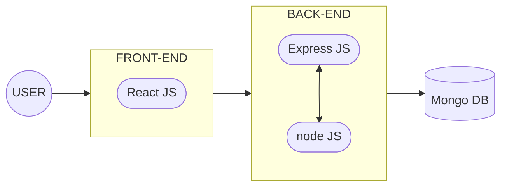

# TechnoStore-Star
**TechnoStore-Star** es un aplicativo web tipo e-commerce, desarrollado por el equipo **SpaceX**, que nace para ayudar a **TechnoStore**, que se ha posicionado exitosamente en el mercado local y busca expandir su mercado a todo el país.
## Contexto
**TechnoStore** es una microempresa que se especializa en la comercialización de piezas y accesorios de cómputo, actualmente se enfrentan con algunos problemas en el abastecimiento de inventario y administración de pedidos debido al rápido crecimiento de sus ventas y la escasez de personal disponible, es por esto que decide optar por una solución tecnológica que le permita abarcar los problemas que se presentan actualmente y garantizar la expansión de su mercado cómodamente.
## Equipo de desarrollo
| Integrantes | Roles |
|-------------|-------|
| Jose Daniel Soto | Administrador de BD |
| Irina Ballesteros Ospino | Analista |
| Angel Alcazar Marenco | Desarrollador |
| Janir Yuni Perez | Desarrollador |
| Camilo Javier Soto Castro | SCRUM master |

## Stack tecnológico
Por su popularidad, versatilidad, amplia documentación, se implementará el stack **MERN** (MongoDB, React JS, Express JS y Node JS), para el desarrollo del proyecto.

